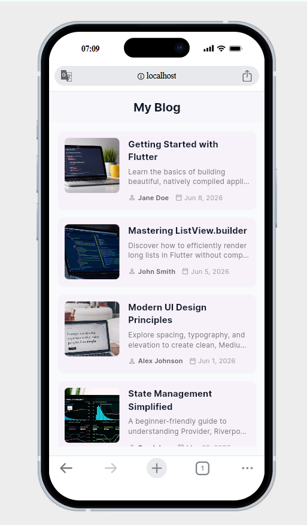

# Flutter Blog Feed Demo — `ListView.builder`

> `ListView.builder` is a scrollable list widget that builds items lazily — only rendering what's visible on screen.

---

## What This App Does

A simple blog feed that displays post cards with a thumbnail, title, description, author, and date. Tapping a card triggers a snackbar. It models a real content feed like Medium or an RSS reader, where you need to scroll through a list of items efficiently.

---

## Run Instructions

```bash
git clone https://github.com/<your-username>/flutter_demo.git
cd flutter_demo
flutter pub get
flutter run
```

> Requires Flutter SDK ≥ 3.11. Tested on Android, iOS, Chrome, and desktop.

---

## Widget in Focus: `ListView.builder`

Found in [`lib/main.dart`](lib/main.dart) inside the `MyBlogPage` widget:

```dart
ListView.builder(
  itemCount: dummyPosts.length,
  scrollDirection: Axis.vertical,
  itemBuilder: (context, index) {
    return BlogCard(post: dummyPosts[index]);
  },
)
```

---

## Three Properties Demonstrated

### 1. `itemCount`
Tells Flutter how many items are in the list.

```dart
itemCount: dummyPosts.length  // 4 items
```

- Without it, the list tries to scroll forever and will throw an index error.
- Setting it to `dummyPosts.length` caps the list at exactly 4 cards and lets Flutter optimize rendering.

---

### 2. `scrollDirection`
Controls which axis the list scrolls along.

```dart
scrollDirection: Axis.vertical   // default — top to bottom
scrollDirection: Axis.horizontal // side-scrolling carousel
```

- Default is `Axis.vertical`.
- Switching to `Axis.horizontal` turns the feed into a horizontal card strip — useful for story reels or image galleries.

---

### 3. `itemBuilder`
A callback that builds each list item on demand.

```dart
itemBuilder: (context, index) {
  return BlogCard(post: dummyPosts[index]);
}
```

- Called only for items currently visible on screen — not all at once.
- Unlike `ListView(children: [...])` which builds everything upfront, `itemBuilder` keeps memory usage low for long or dynamic lists.

---

## Screenshot



> *Screenshot shows the blog feed with four scrollable post cards.*

---

## Dependencies

- [`google_fonts ^6.1.0`](https://pub.dev/packages/google_fonts) — Inter font
- Flutter SDK `^3.11.5`

---

## Sources

- Flutter docs: https://api.flutter.dev/flutter/widgets/ListView-class.html
- Thumbnail images: https://unsplash.com
